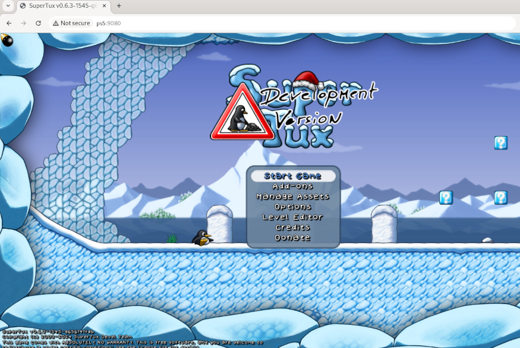

# GenWebServer

GenWebServer is a simple web server written in C to provide basic HTTP service. 


## Features

- Static Content Hosting.
- Access Logging.
- IPv4 and IPv6 Support.
- IP Whitelisting.
- Customizable Port.
- Custom Error Messaging.

## Configuration

The server reads its settings from `/data/genwebserver/genwebserver.conf`:

```plaintext
port = 8000
site_path = /data/genwebserver/site/
allowed_ips = 0.0.0.0, ::
conn_timeout = 30
forbidden_msg = 403 Forbidden
```

### Configuration Parameters

- **port**: The port on which the server will listen (default: `8000`).
- **site_path**: The directory where the static content is hosted (default: `/data/genwebserver/site/`).
- **allowed_ips**: Comma-separated list of IPs or IP ranges (in CIDR notation) that are allowed to access the server. Set to `0.0.0.0` to allow all IPv4 addresses and `::` to allow all IPv6 addresses (default: `0.0.0.0, ::`).
- **conn_timeout**: The connection timeout in seconds for the server (default: 30).
- **forbidden_msg**: Custom message displayed to users when access is denied (default: 403 Forbidden).

### Example Configuration

```plaintext
port = 9000
site_path = /user/home/site/
allowed_ips = 192.168.1.100, 192.168.1.101, 192.168.2.0/24, fd00::/64, ::1
conn_timeout = 5
forbidden_msg = Access Denied
```

This configuration:
- Runs the server on port `9000`.
- Serves content from `/user/home/site/`.
- Allows access only from:
  - `192.168.1.100`
  - `192.168.1.101`
  - All IPs in the `192.168.2.0/24` range.
  - All IPv6 addresses in the `fd00::/64` range.
  - IPv6 loopback address (`::1`).
- Sets a connection timeout of 5 seconds.
- Displays "Access Denied" when access is forbidden.


## How to Use

1. Send the `elfldr.elf` payload to port 9020.
2. Send the `genwebserver.elf` payload to port 9021.
3. Access the server at `http://ps5:<port>` (default port: `8000`) or `http://ps5:<port>/index.html`.


## Recommendations

Because of the PS5 browser's limitations¹ and to keep things secure, it's best to access GenWebServer remotely only from devices connected to your local network.


¹Things like audio issues, no [WebGL](http://get.webgl.org/) support, no permissions to access internal files, etc.


## Website Examples

<div align="center">


<br>
<p><em>website-example: <a href="https://github.com/attogram/games">https://github.com/attogram/games</a></em></p>


<br>
<p><em>website-example02: <a href="https://github.com/EmulatorJS/EmulatorJS">https://github.com/EmulatorJS/EmulatorJS</a></em></p>


<br>
<p><em>website-example03: <a href="https://github.com/SuperTux/supertux">https://github.com/SuperTux/supertux</a></em></p>

</div>

### Other Examples

* [3D Pinball for Windows - Space Cadet](https://github.com/k4zmu2a/SpaceCadetPinball)
* [Angband](https://github.com/angband/angband)
* [AstroMenace](https://github.com/midzer/astromenace)
* [Asylum](https://github.com/GMH-Code/Asylum)
* [Ballerburg SDL](https://baller.tuxfamily.org/)
* [Blobby Volley 2](https://github.com/danielknobe/blobbyvolley2)
* [Bloboats](https://github.com/midzer/bloboats)
* [Bombermaaan](https://github.com/midzer/Bombermaaan)
* [Caesar III](https://github.com/bvschaik/julius)
* [Cave Story](https://github.com/midzer/nxengine-evo)
* [C-Dogs SDL](https://github.com/midzer/cdogs-sdl)
* [Chromium B.S.U.](https://github.com/midzer/chromium-bsu)
* [Claw](https://github.com/midzer/OpenClaw)
* [Command & Conquer](https://github.com/midzer/Vanilla-Conquer)
* [Cro-Mag Rally](https://github.com/midzer/CroMagRally)
* [Der Clou!](https://github.com/midzer/derclou)
* [Descent I](https://github.com/midzer/dxx-rebirth)
* [Doom 3](https://github.com/gabrielcuvillier/d3wasm)
* [Dungeon Rush](https://github.com/midzer/DungeonRush)
* [Dune II](https://github.com/midzer/OpenDUNE)
* [Fallout](https://github.com/midzer/fallout1-ce)
* [Flare](https://github.com/midzer/flare-engine)
* [Flashback](https://github.com/midzer/reminiscence)
* [Freegemas](https://github.com/midzer/freegemas)
* [Freegish](https://github.com/midzer/freegish)
* [Freeserf](https://github.com/midzer/freeserf)
* [FreeSiege](https://github.com/midzer/freesiege)
* [Heroes of Might and Magic II](https://github.com/midzer/fheroes2)
* [Homeworld](https://github.com/GardensOfKadesh/Homeworld)
* [Hurrican](https://github.com/midzer/hurrican)
* [Jagged Alliance 2](https://github.com/midzer/ja2-stracciatella)
* [Jazz Jackrabbit](https://github.com/midzer/openjazz)
* [Jazz Jackrabbit 2](https://github.com/deathkiller/jazz2-native)
* [Jump 'n Bump](https://github.com/midzer/jumpnbump)
* [LBreakoutHD](https://github.com/midzer/lbreakouthd)
* [Li-Ri](https://github.com/midzer/Li-Ri)
* [Master of Orion](https://github.com/midzer/1oom)
* [Neverball](https://github.com/Neverball/neverball)
* [Numpty Physics](https://github.com/midzer/numptyphysics)
* [OpenFodder](https://github.com/OpenFodder/openfodder)
* [OpenTyrian](https://github.com/midzer/opentyrian)
* [Prince of Persia](https://github.com/midzer/SDLPoP)
* [Raptor - Call of the Shadows](https://github.com/midzer/raptor)
* [REminiscence](https://github.com/midzer/reminiscence)
* [Rise of the Triad](https://github.com/midzer/rottexpr)
* [Rocks'n'Diamonds](https://www.artsoft.org/rocksndiamonds/)
* [SDL-Ball](https://github.com/midzer/sdl-ball)
* [SDL Sopwith](https://github.com/fragglet/sdl-sopwith)
* [Shiromino](https://github.com/midzer/shiromino)
* [Simutrans](https://github.com/midzer/simutrans)
* [Star Wars Jedi Knight: Dark Forces II](https://github.com/shinyquagsire23/OpenJKDF2)
* [Syndicate](https://github.com/midzer/freesynd)
* [Super Mario War](https://github.com/mmatyas/supermariowar)
* [The Legend of Zelda - A Link to the Past](https://github.com/midzer/zelda3)
* [Tower To Heaven](https://codeberg.org/midzer/tth)
* [Vectoroids](https://github.com/midzer/vectoroids)
* [Water Closet](https://github.com/midzer/waterCloset)
* [WipEout](https://github.com/phoboslab/wipeout-rewrite)
* [Wolfenstein 3D](https://github.com/midzer/wolf4sdl)
* [XCOM](https://github.com/midzer/OpenXcom)
* [xrick](https://www.xrick.net/)


## Credits

- ps5-payload-sdk

