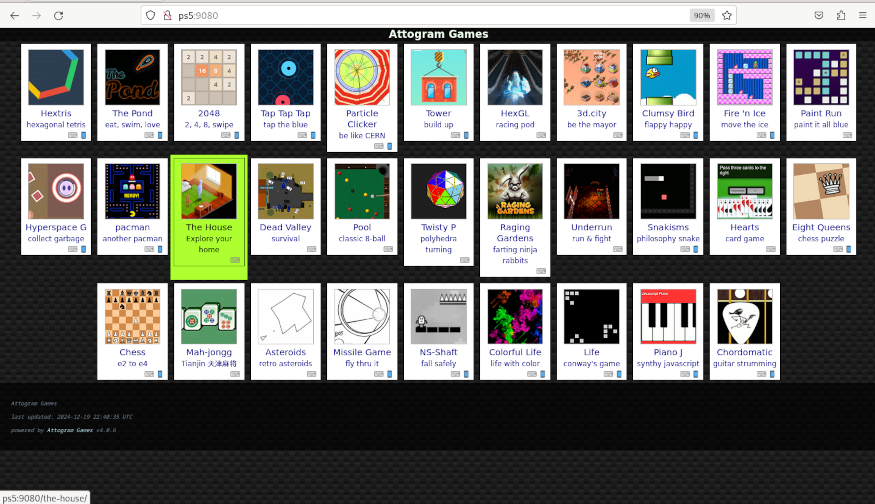

# GenWebServer

GenWebServer is a simple web server written in C to provide basic HTTP service. 


## Features

- Static Content Hosting.
- Access Logging.
- IPv4 and IPv6 Support.
- IP Whitelisting.
- Customizable Port.
- Custom Error Messaging.

## Configuration

The server reads its settings from `/data/genwebserver/genwebserver.conf`:

```plaintext
port = 8000
site_path = /data/genwebserver/site/
allowed_ips = 0.0.0.0, ::
conn_timeout = 30
forbidden_msg = 403 Forbidden
```

### Configuration Parameters

- **port**: The port on which the server will listen (default: `8000`).
- **site_path**: The directory where the static content is hosted (default: `/data/genwebserver/site/`).
- **allowed_ips**: Comma-separated list of IPs or IP ranges (in CIDR notation) that are allowed to access the server. Set to `0.0.0.0` to allow all IPv4 addresses and `::` to allow all IPv6 addresses (default: `0.0.0.0, ::`).
- **conn_timeout**: The connection timeout in seconds for the server (default: 30).
- **forbidden_msg**: Custom message displayed to users when access is denied (default: 403 Forbidden).

### Example Configuration

```plaintext
port = 9000
site_path = /user/home/site/
allowed_ips = 192.168.1.100, 192.168.1.101, 192.168.2.0/24, fd00::/64, ::1
conn_timeout = 5
forbidden_msg = Access Denied
```

This configuration:
- Runs the server on port `9000`.
- Serves content from `/user/home/site/`.
- Allows access only from:
  - `192.168.1.100`
  - `192.168.1.101`
  - All IPs in the `192.168.2.0/24` range.
  - All IPv6 addresses in the `fd00::/64` range.
  - IPv6 loopback address (`::1`).
- Sets a connection timeout of 5 seconds.
- Displays "Access Denied" when access is forbidden.


## How to Use

1. Send the `elfldr.elf` payload to port 9020.
2. Send the `genwebserver.elf` payload to port 9021.
3. Access the server at `http://ps5:<port>` (default port: `8000`) or `http://ps5:<port>/index.html`.


## Website examples:

<div align="center">


<br>
<p><em>website-example: <a href="https://github.com/attogram/games">https://github.com/attogram/games</a></em></p>


<br>
<p><em>website-example02: <a href="https://github.com/EmulatorJS/EmulatorJS">https://github.com/EmulatorJS/EmulatorJS</a></em></p>

</div>

## Recommendations:

Because of the PS5 browser's limitations¹ and to keep things secure, it's best to access GenWebServer remotely only from devices connected to your local network.


¹Things like audio issues, no WebGL support, no permissions to access internal files, etc.


## Credits

- ps5-payload-sdk

